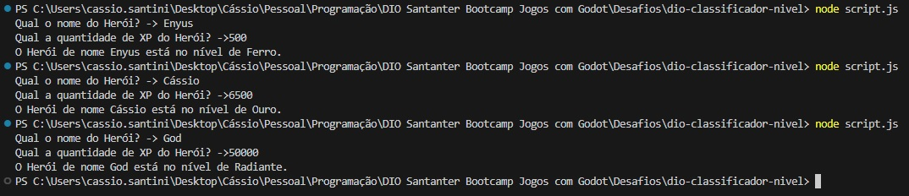

# Desafio - Classificador de Nível de Herói
Desafio Classifcador de Nível de Herói do Bootcamp Santander-DIO Jogos com Godot.

## Instruções para entrega
### 1️⃣ Desafio Classificador de nível de Herói

**O Que deve ser utilizado**

- Variáveis
- Operadores
- Laços de repetição
- Estruturas de decisões

**Objetivo**

Crie uma variável para armazenar o nome e a quantidade de experiência (XP) de um herói, depois utilize uma estrutura de decisão para apresentar alguma das mensagens abaixo:

Se XP for menor do que 1.000 = Ferro
Se XP for entre 1.001 e 2.000 = Bronze
Se XP for entre 2.001 e 5.000 = Prata
Se XP for entre 5.001 e 7.000 = Ouro
Se XP for entre 7.001 e 8.000 = Platina
Se XP for entre 8.001 e 9.000 = Ascendente
Se XP for entre 9.001 e 10.000= Imortal
Se XP for maior ou igual a 10.001 = Radiante

**Saída**

Ao final deve se exibir uma mensagem:
"O Herói de nome **{nome}** está no nível de **{nivel}**"

## Para rodar o projeto
1. Com o Node Instalado, faça o clone do repositório com o comando `git clone https://github.com/Enyus/dio-classificador-nivel.git`
2. Entre na pasta do repo com o comando `cd dio-classificador-nivel`
3. Rode o comando `node script.js`
4. No próprio console de comandos, o programa deve perguntar o Nome do Herói e sua Quantidade de XP, recebendo um retorno parecido com:

## Observações
Para deixar o projeto mais interativo, usei a biblioteca nativa do Node chamada Readline, que permite que o usuário passe dados para o sistema diretamente no console. [Veja o Link](https://nodejs.org/api/readline.html).